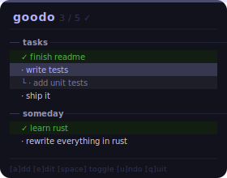

# goodo

<p align="center">
  
</p>

A keyboard-driven todo app for the terminal.

## Install

```bash
curl -fsSL https://raw.githubusercontent.com/jensbech/goodo/main/install | bash
```

Binaries available for macOS (ARM64/x86_64), Linux (x86_64/ARM64), and Windows (x86_64).

## Usage

```bash
goodo
```

Your todos are saved automatically to `~/.local/share/goodo/todos.json`.

## Keybindings

| Key | Action |
|-----|--------|
| `a` | Add new todo |
| `A` | Add subtask under selected |
| `e` | Edit selected |
| `space` / `enter` | Toggle done |
| `j` / `k` | Navigate down / up |
| `J` / `K` | Move item down / up |
| `g` / `G` | Jump to top / bottom |
| `Tab` | Indent into subtask of item above |
| `Shift+Tab` | Promote subtask to top level |
| `x` | Delete (no confirm for single items) |
| `d` | Delete with confirm |
| `u` | Undo |
| `r` | Redo |
| `q` | Quit |

## Development

```bash
cargo build    # debug build
just build     # release build
just release   # bump version, build all targets, publish to GitHub
```
